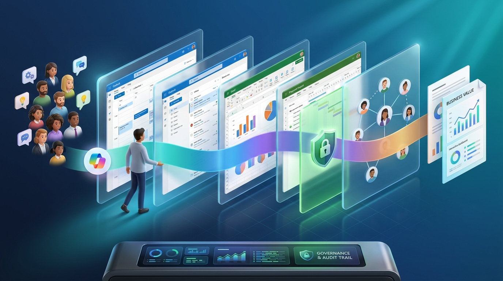
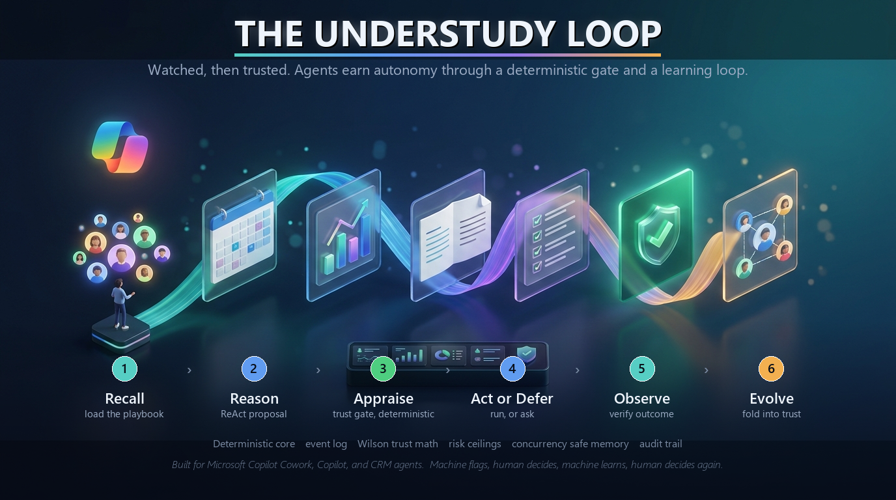

<div align="center">

# Understudy

**An earned autonomy trust gate for AI agents, shipped as an MCP server so Microsoft Copilot, Copilot Cowork, Copilot Studio, and CRM agents can ask it before they act.**


</div>



An understudy learns a role by watching the lead, and goes on alone only after showing they can carry it. I built Understudy to do that for an AI agent. It watches how your team handles a kind of task, learns the steps, and lets the agent run that task by itself only once it has matched your team's judgment enough times to deserve it. The first time something it did on its own has to be undone, it drops straight back to asking a person.

The point is simple. Autonomy should be earned and revocable, not a flag someone sets in a config file and forgets. Understudy is the small, deterministic engine that makes that real, and any Copilot, Cowork, or CRM agent can call it before it commits a consequential step.

## Why this exists

Put an agent in front of real work and every task forces the same choice. Either a person approves everything, which gives back no time and trains reviewers to click approve without reading, or you switch on full autonomy and accept that one wrong action can cost real money, a contract, or trust. Neither answer is good enough to ship.

What has been missing is a way to decide, from evidence, which tasks an agent has earned the right to do alone, judged by your team's own standard, and a way to pull that right back the moment it starts to slip. That decision is the whole job Understudy does.

## How it works: the Understudy Loop

Prompting an agent once is a single shot. Understudy runs a loop instead. It starts from the ReAct pattern, thought then action then observation, and adds the two steps ReAct never had: a deterministic trust gate, and a step that folds the result back into what the agent is allowed to do next. It is a loop of loops, not a chain of prompts.



1. **Recall** the learned playbook for this kind of task.
2. **Reason** through a ReAct trace to a concrete proposal. This is the only step that runs a model.
3. **Appraise.** The deterministic gate scores trust and decides act or ask. No model runs here.
4. **Act or Defer.** Run it, or hand it to a person.
5. **Observe** what actually happened.
6. **Evolve.** Fold the verdict and the outcome back into the playbook and the trust score.

It lines up with the human in the loop idea this grew out of: machine flags, human decides, machine learns, human decides again.

## What keeps it safe

The learning part is probabilistic and will never be perfect. That is fine, because it is always wrapped by the deterministic gate, and everything that matters for safety is plain code with no model in the path.

- Trust is the lower bound of a Wilson score interval, so three out of three is treated as thin evidence, not proof.
- A reviewer who approves almost everything, and whose approvals later get reverted, is down weighted. A rubber stamp cannot inflate trust.
- A confirmed autonomous action never raises trust, because that would be the agent grading its own work. A reverted one is recorded as a lasting failure.
- Hiring, privileged access, and large payments carry a hard ceiling and never reach full autonomy, however clean the record looks.
- Risk classification fails closed. A field that looks like money or access but is not recognised is treated as critical, never as low value.

## Shared state under load

This is the part I was most careful about. Multi agent systems quietly corrupt shared state when they run at the same time: two agents read a value, change it, write it back, and lose each other's work without an error. Understudy treats agent memory the way you would treat any distributed system.

The event log is append only and is the single source of truth, so trust is folded from it on read and there is no mutable counter to overwrite. Every write carries an idempotency key, so a retry never counts twice. Materialised state uses compare and set with a safe retry, and when two updates land together they merge by rule instead of last write wins.

The proof harness fires three hundred concurrent writes:

```
naive read then write counter : 22 of 300   (most updates silently lost)
understudy versioned store     : 300 of 300
understudy event log           : 300 of 300, hash chain verified
```

## Watch it earn, and lose, autonomy

One task class, run over and over with a careful reviewer and confirmed outcomes, then a single bad outcome at t11:

```
t1..t8   ASK_ALWAYS       trust climbs 0.0 to 0.65   bootstrapping
t9       ASK_WHEN_UNSURE  trust 0.676
t10      AUTONOMOUS       trust 0.701                no human needed
t11      AUTONOMOUS       then the outcome is REVERTED
t12      ASK_ALWAYS       trust drops to 0.596       demoted at once
```

That is the whole idea in twelve lines. Earn it, use it, lose it the moment it fails.

## Install

One command writes a ready MCP client config and picks which model serves each risk tier, based on how hard you plan to lean on it.

```
pip install -e ".[mcp]"
understudy install --usage balanced
```

`balanced` sends low risk work to the fast model, standard work to the mid model, and high risk and reasoning heavy work to the strongest model. `light` and `heavy` shift that, and you can override any tier by hand. The same command registers the Playwright MCP server next to the gate, so the browser tools are there the moment the host starts. Pass `--no-playwright` if you want only the gate. Drop the generated block into your Copilot, Copilot Studio, or other MCP client, or run the server directly with `understudy serve-mcp`.

## The MCP tools

Your agents and skills keep doing the work. They route the risky step through the gate.

- `evaluate_gate(domain, verb, payload)` returns the autonomy level, whether a human is required, the trust score and target, the risk bucket, and the model tier that suits the task.
- `submit_verdict(task_id, bucket_key, reviewer_id, verdict, edit_distance)` records APPROVE, EDIT, or REJECT.
- `submit_outcome(task_id, bucket_key, outcome)` records CONFIRMED or REVERTED.
- `trust_snapshot(...)` reads trust without changing anything.
- `trust_matrix()` returns trust for every task class the gate has seen.

There is also a REST surface and a small trust dial dashboard for an operations or IT lead: `pip install -e ".[api]"` then `understudy serve-api`.

## Browser tasks through Playwright MCP

A lot of real work happens in a browser, so the Watcher and Hands drive the browser through the Playwright MCP rather than reimplementing automation. Installing Understudy registers that server for you: `understudy install` writes both the gate and the Playwright MCP into one config, and the host launches them together. On first run npx fetches the package, and `npx playwright install` adds the browsers once.

Inside Understudy the two sides meet in `crew/playwright_bridge.py`. The bridge starts the Playwright MCP, holds one session open on a background loop, and hands the Watcher a synchronous client, so the capture loop reads the page with `browser_snapshot` and acts with `browser_click` and `browser_type` against a real browser, then turns the recorded steps into a draft playbook for the Scribe. The bridge and the capture loop are unit tested with a fake session, so the rest of the system runs with no browser at all. The one thing the repo cannot bottle is the host: a machine with Node and the Playwright browsers, which is the standard requirement for Playwright MCP everywhere.

## How it sits next to your skill files

Your teams already write skill files for Copilot Cowork and Copilot Studio, one per process, and those differ at every company. That is the right home for the work itself, and Understudy does not replace it. It is the trust and learning layer the skill calls.

A skill keeps describing how to draft the campaign or code the invoice. Before it commits the step with consequences, it calls `evaluate_gate`. Early on the gate says ask a person. As approvals stack up and the outcomes hold, the same skill, with no change to it, earns the right to run that step alone. For CRM work the same idea ships as a connector: `GatedCrm` in `integrations/crm.py` routes every write through the gate, with an in memory reference adapter you can run today and a clear seam for Salesforce, HubSpot, or Dynamics. Because all of this speaks MCP, the same gate works across the Copilot family and any other runtime that reads the protocol.

## What it changes for the team

- Review time comes back as trust grows, and the shift is measured against recorded decisions rather than guessed at.
- A bad autonomous action is demoted at once, so one mistake does not turn into ten.
- When a risk officer asks what exactly the agents are allowed to do, the answer is a signed, tamper evident record, not a shrug.
- Spend stays proportional, because the router keeps the strongest model for the work that actually needs it.

## Where it actually stands

Everything that is code is built and tested. The few things that need your own tenant, keys, or users are called out as exactly that.

Built and tested (52 unit tests, the proof harness, and the end to end demo all green):

- the deterministic core, the Understudy Loop, and the MCP server, which loads as a FastMCP server with all five tools registered
- a CRM connector that routes writes through the gate, with a complete in memory reference adapter
- the browser bridge that launches the Playwright MCP and drives a real browser through it, plus the install step that registers that server next to the gate, both unit tested with a fake session
- the real model client path, unit tested through an injected client
- a Copilot plugin packaging scaffold that assembles the Teams app bundle

Needs your resources, not more code:

- a live Copilot Cowork tenant to install the packaged plugin and validate the manifest against the current preview schema
- credentials to point the CRM connector at a real Salesforce, HubSpot, or Dynamics instance
- a host with Node and the Playwright browsers to capture real sessions, and an API key to run the real model client
- real teams using it, to turn the simulated proofs into field data

## Run it yourself

None of this needs a network or a Copilot tenant.

```
python -m unittest discover -s tests -t .
understudy prove
understudy demo
```

## Layout

```
understudy/
  core/          deterministic engine, no model in the path
  crew/          the Understudy Loop agents, the ReAct engine, and browser capture
  integrations/  the CRM connector that routes writes through the gate
  mcp_server/    the MCP server, named to avoid shadowing the SDK
  api/           REST surface and trust dial dashboard
  packaging/     the Copilot plugin bundle builder
  simulations/   the proof harness and the end to end demo
  tests/         the unit suite
  cli.py         prove, demo, serve-mcp, serve-api, install
```

## Roadmap

- A Postgres backed event log for multi node deployments, behind the same interface the file backed log already implements.
- Connect the browser capture adapter to a live Playwright MCP, so playbooks are learned from real sessions.
- Real Salesforce, HubSpot, and Dynamics adapters behind the CRM connector interface.
- A tenant trial with the packaged plugin, to move from working prototype to field proven.

## Questions you might have

**Is this another agent that does my work?** No. It decides how much your agents are trusted to do alone. Your skills still do the work.

**Can the autonomy ever do something reckless?** Only the deterministic gate can grant autonomy, high stakes classes are capped so they never reach it, and a reverted outcome demotes the class immediately.

**Does it lock me into a vendor?** No. The core is plain Python with zero dependencies, storage is an append only log, and the surface is open MCP.

## License

MIT. Built and maintained by Ahmed Raoofuddin.
